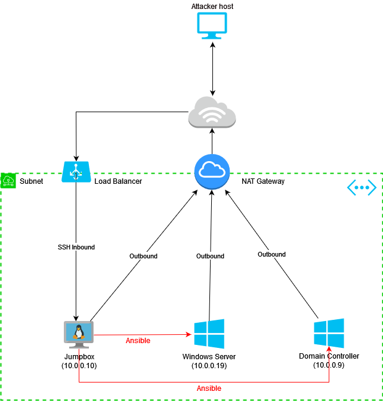

# Auror-Project-Challenge-1
Auror Project Challenge 1 - Automated Active Directory Lab Deployment



Challenge Link - [Challenge] ((https://docs.google.com/document/d/1Zk_O_JpFQk5JQRGF9CAC0plml3ua3hCQ5VBDLxE2GQI/edit?usp=sharing))

Blog corresponding to the lab setup - [Blog] ((https://sbasu7241.medium.com/auror-project-challenge-1-automated-active-directory-lab-deployment-53e323445f4d))

### Lab Setup

1. Git clone the repo
2. Setup Azure CLI
3. Open powershell and navigate to the Terraform directory
4. Initalize working directory for terraform 

```
    terraform init
```

5. Preview plan of the infra to be created

```
    terraform plan
```

6. Apply the previewed plan to start the infra setup

```
    terraform apply
```

### References

* https://github.com/chvancooten/CloudLabsAD
* https://github.com/clong/DetectionLab
